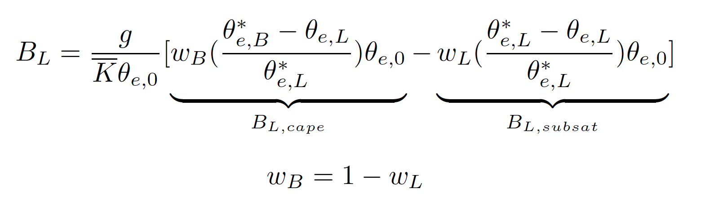

**MCS Precipitation and Buoyancy Diagnostic** 

This POD provides diagnostics of tropical mesoscale convective systems (MCSs) and their thermodynamic environments, informed by an empirical buoyancy measure (BL). Specifically, these diagnostics are designed to evaluate model performance in representing basic spatial-temporal characteristics of tropical MCSs and associated precipitation responses to the buoyancy measure under MCS and non-MCS conditions.

**Notes for interpretation**

- **MCS frequency & MCS precipitation contribution**

   .. image:: ./precipitation_MCScontribution.png
       :width: 850px
       :height: 250px
       :alt: Prec Image

   The default “snapshot-based” MCS definition identifies a rainy cold cloud with an area greater than 40,000 km². As a result, the statistics primarily reflect MCS characteristics at their mature stage. This may help explain the relatively lower contribution of MCSs to total precipitation in the observational reference compared with values reported in the literature. 

- **2-D joint histogram and conditioanlly-averaged precipitation**: 

    .. image:: ./BLprecip_capesubsat_merged_2005-2014.ocean.png
       :width: 850px
       :height: 250px
       :alt: BL Image

    precipitation sensitivity to BL,cape and BL,subsat for conditions associated with MCS, non-MCS deep, and others. For example, models tend to exhibit enhanced conditionally averaged precipitation when BL,subsat ≈ 0, while showing comparatively weak sensitivity to BL,cape. This behavior suggests that precipitation in models is triggered primarily under near-saturated lower-free troposphere, implying that convection parameterization schemes (where present) may play a reduced role relative to what is inferred from observations. 

    Two regimes (indicated by the triangle and rectangle) are highlighted: the highly buoyant regime, which typically exhibits a sharp enhancement of precipitation with increasing BL buoyancy, and the low-BL,cape, near-saturated regime, which is more commonly associated with stratiform precipitation.

**Required Variables (settings.jsonc)**

- 3-D variables: air temperature (ta), specific humidity (hus)
- 2-D variables: precipitation flux (pr), and TOA outgoing longwave radiation (rlut) 
- 3-D data structure (tilme, plev, lat,, lon) / 2-D data structure (time, lat, lon)

+----------------------------+------------------------------------------------------+
| Required Variables         | Data Frequency                                       |
+============================+======================================================+
| MCS identification:        | Snapshots or short averages (< 6 hr),                |
| **pr**, **rlut**           | not dependent on sampling frequency                  |
+----------------------------+------------------------------------------------------+
| Low-tropospheric buoyancy: | Corresponding times at which MCSs                    |
| **ta**, **hus**            | are identified                                       |
+----------------------------+------------------------------------------------------+

**Minimum Data Requirement**

- Length: at least one year of 3-hourly data to ensure sufficient tropical MCS sampling. (Observational reference is based on 10-year data)
- Resolution: higher horizontal resolution (≤ 0.5°) is recommended. 

**Information of Output Data** 

- The estimate of data size for the high frequency outputs (1-year, 3-hrly, ~0.5 degree) is about 8 GB per year. 
- The condensed statistics (monthly, regridded data) is about 100 MB per year. 
- Users may choose to retain high-frequency outputs or keep only condensed statistics to save storage. 

**Optional Settings for Diagnostics (settings.jsonc)**

- Regridding resolution for model statistic (regrid_res): regrid data from the native grid space into 0.5 and 1 (default = 1). Set “None” to skip the regridding request. Conservative regridding is applied by default to ensure consistent comparisons between model outputs and the observational reference (GPM-IMERG + ERA5, 0.25°/0.5°/1°) 
- MCS parameters in the default identifier (minsize_MCS, minsize_PF, min_TbCold, min_TbCore): minimum cloud size, minimum size of precipitation feature, temperature thresholds

- Alternative MCS input data from trackers (run_mcs_off): external MCS tracking data is supported via standardized input directories and variables (see the following section “pipeline of diagnostics processes”)

**Pipelines of diagnostics processes:**

- run_MCS_identifier 
    For users with their own 2-D MCS masks, create a directory named "**MCS_identifier**" under the MDTF default work path **"mdtf/wkdir/MDTF_output/MCS_precip_buoy_stats/model/netCDF/MCS_identifiers"**. Organize the data chronologically by year (e.g., 2005, 2006 ...), with each year’s folder containing the corresponding high-frequency 2-D MCS mask files (e.g., cloudid_PyFLEXTRKR_mcs_20071231.0000.nc) 

- run_precip_statistics
    Calculate precipitation-associated statistics and create condense statistics netCDF files
- run_buoyancy_calculation
    Calculate the lower-tropospheric buoyancy measure
- run_buoyancy_statistics
    Calculate the 2-D histograms of buoyancy components + conditionally-averaged precipitation and create the corresponding condense statistics netCDF files
- plot_precip_statistics
    Plot maps of MCS frequency and MCS-associated precipitation 
- plot_buoyancy_precip_statistics
    Plot joint histograms and conditionally-averaged precipitation for grid points labeled as MCS, Non-MCS deep, and other.

**Reference** 

    Ahmed, F., & Neelin, J. D. (2021). A process‐oriented diagnostic to assess precipitation‐thermodynamic relations and application to CMIP6 models. Geophysical Research Letters, 48(14).

    Tsai, W.-M., F. Ahmed, J. D. Neelin, Zhe Feng, and L. Ruby Leung (2026). Buoyancy-Precipitation Coupling in the Life Cycle of Tropical Mesoscale Convective Systems, Geophysical Research Letters, under review (preprint https://essopenarchive.org/doi/pdf/10.22541/essoar.175165621.17354518)

**Methodology** 

Following Ahmed and Neelin (2021), an **empirical buoyancy measure** is calculated to represent the MCS-associated environments in this POD. Unlike traditional parcel-based buoyancy, the BL measure incorporates vertical thermodynamic structure and deep-inflow, mass-flux–driven entrainment processes in the lower troposphere. 
BL,cape: undilute CAPE-like instability, implying the buoyancy of a parcel as it rises without entrainment BL,subsat: the dilution of the parcel buoyancy through entrainment effects from the lower free troposphere, expressed by the subsaturation.

- **BL,cape**: undilute CAPE-like instability, implying the buoyancy of a parcel as it rises without entrainment.
- **BL,subsat**: the dilution of the parcel buoyancy through entrainment effects from the lower free troposphere, expressed by the subsaturation.

Tropical MCSs are identified using outgoing longwave radiative flux and precipitation, following similar definitions in PyFLEXTRKR. The default MCS identification of the POD is “snapshot-based”, while users can implement their own MCS 2-D mask datasets and skip the step of identifying MCSs (see settings.jsonc).

**The definition of an MCS:**

we adopt parameters described in PyFLEXTRKR (Feng et al., 2021;2023) to identify connected cloud objects using brightness temperature. Brightness temperature is converted from outgoing longwave radiation following Ohring et al. (1984)

- Cold cloud size > 40,000 km²; cold cloud (Tb < 241 K)
- Precipitation feature (> 1,000 km², precip > 0.5 mm/hr)
- Existence of core cloud (Tb < 225 K, at least one pixel)
